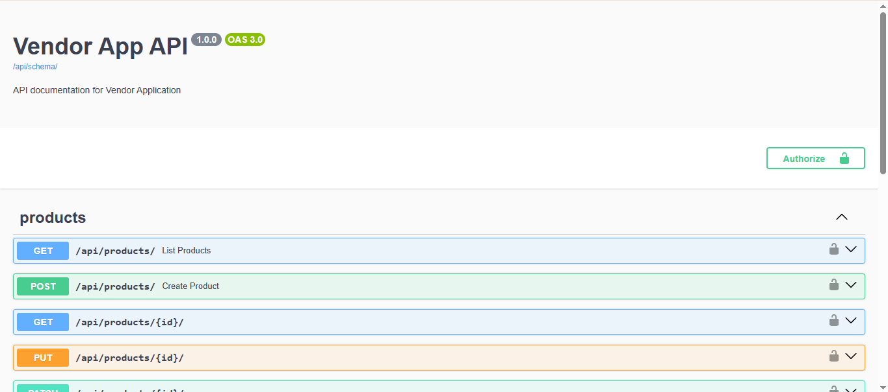
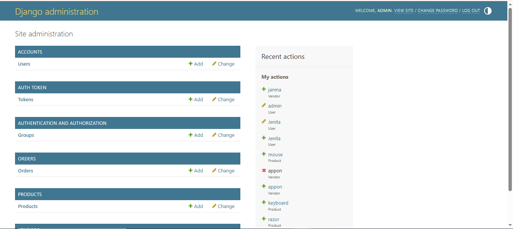
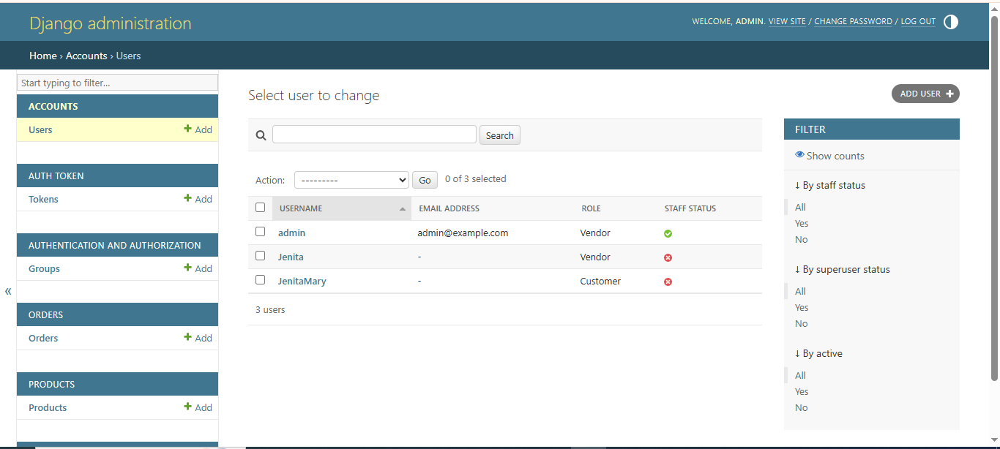

# Vendor Management System – Backend API


A production-ready **Vendor Management REST API** built with **Django 5**, **Django REST Framework**, and **PostgreSQL**.

The application demonstrates modern backend engineering practices including secure JWT authentication, multi-tenant authorization, object-level permissions, automated testing, production deployment, and a scalable project architecture. It serves as the backend for a full-stack Vendor Management System with a React frontend and upcoming AI-powered features.

---

## Table of Contents

- [Live Demo](#-live-demo)
- [Features](#-features)
- [Architecture](#-architecture)
- [Tech Stack](#-tech-stack)
- [Project Structure](#-project-structure)
- [Production Features](#-production-features)
- [API Documentation](#-api-documentation)
- [Core API Endpoints](#-core-api-endpoints)
- [Engineering Highlights](#-engineering-highlights)
- [Screenshots](#-screenshots)
- [Running the Project Locally](#-running-the-project-locally)
- [Running Tests](#-running-tests)
- [Roadmap](#-roadmap)
- [Author](#-author)

# 🚀 Live Demo

**Live API**

https://vendor-app-backend-q553.onrender.com

**Swagger API Documentation**

https://vendor-app-backend-q553.onrender.com/api/docs/

---

# ✨ Features

## Authentication

* JWT Authentication
* Refresh Token Support
* Protected REST APIs
* Custom User Model
* Role-based Users (Admin, Vendor, Customer)

## Vendor Management

* Vendor Profile Management
* One-to-One User ↔ Vendor Relationship
* Secure Vendor Ownership
* Multi-Tenant Data Isolation

## Product Management

* Create Products
* Update Products
* Delete Products
* Product Detail
* Product Listing
* Product Image Upload

## API Features

* RESTful API Design
* Search
* Ordering
* Pagination
* Interactive Swagger Documentation
* OpenAPI Schema

## Security

* JWT Authentication
* Object-Level Permissions
* Vendor Ownership Validation
* Multi-Tenant Resource Isolation
* Resource Hiding (404 for unauthorized resources)
* Environment-Based Configuration
* Production Settings Separation

## Testing

The project includes automated tests covering:

* Authentication
* JWT Tokens
* Product CRUD Operations
* Vendor Permissions
* Search
* Ordering
* Pagination
* Image Upload

Current automated test suite:

* 12+ passing tests

---

# 🏗 Architecture

```text
               Browser / React Frontend
                         │
                         ▼
               Django REST Framework API
                         │
               JWT Authentication
                    & Permissions
                         │
               ──────────────────────────────
               Accounts   Vendors   Products
                         │
                         ▼
                    PostgreSQL
                         │
                         ▼
                    Render Cloud
```

---

# 🛠 Tech Stack

### Backend

* Python 3
* Django 5
* Django REST Framework

### Authentication

* Simple JWT

### Database

* PostgreSQL

### API Documentation

* drf-spectacular (Swagger/OpenAPI)

### Image Processing

* Pillow

### Deployment

* Render
* Gunicorn
* WhiteNoise
* HTTPS

### Configuration

* python-decouple
* Environment Variables

---

# 📁 Project Structure

```text
vendor_app/
│
├── accounts/
├── vendors/
├── products/
├── orders/
├── config/
│   └── settings/
│       ├── base.py
│       ├── development.py
│       └── production.py
│
├── templates/
├── media/
├── manage.py
├── requirements.txt
└── README.md
```

---

# 🔒 Production Features

* Cloud PostgreSQL Database
* Environment Variable Configuration
* Gunicorn WSGI Server
* WhiteNoise Static File Serving
* HTTPS Deployment
* Production Settings Module
* Secure Secret Management

---

# 📚 API Documentation

Swagger UI

```text
/api/docs/
```

OpenAPI Schema

```text
/api/schema/
```

---
# Core API Endpoints

| Method | Endpoint | Description |
|--------|----------|-------------|
| POST | /api/token/ | Obtain JWT Token |
| POST | /api/token/refresh/ | Refresh JWT Token |
| GET | /api/products/ | List Products |
| POST | /api/products/ | Create Product |
| GET  | /api/products/{id}/
| PATCH | /api/products/{id}/ | Update Product |
| DELETE | /api/products/{id}/ | Delete Product |

# Engineering Highlights

- Custom User Model with role-based access control
- JWT Authentication with automatic refresh tokens
- Object-level permissions for multi-tenant security
- Environment-specific Django settings
- Production-ready deployment on Render
- PostgreSQL integration
- RESTful API design
- Interactive Swagger documentation
- Automated backend testing

# 🧪 Running the Project Locally

## Clone Repository

```bash
git clone https://github.com/jenita-mary/vendor-app-backend.git
```

## Create Virtual Environment

```bash
python -m venv venv
```

## Activate Virtual Environment

Windows

```bash
venv\Scripts\activate
```

Linux / macOS

```bash
source venv/bin/activate
```

## Install Dependencies

```bash
pip install -r requirements.txt
```

## Configure Environment Variables

Create a `.env` file and configure:

* SECRET_KEY
* DEBUG
* ALLOWED_HOSTS
* DB_NAME
* DB_USER
* DB_PASSWORD
* DB_HOST
* DB_PORT

## Apply Migrations

```bash
python manage.py migrate
```

## Run Development Server

```bash
python manage.py runserver
```

---

# ✅ Running Tests

Execute the complete automated test suite:

```bash
python manage.py test
```

---

# 🚀 Roadmap

## Completed

* Django 5
* Django REST Framework
* PostgreSQL
* JWT Authentication
* Vendor Management
* Product CRUD
* Image Upload
* Search
* Ordering
* Pagination
* Swagger Documentation
* Automated Testing
* Render Deployment
* WhiteNoise
* Gunicorn
* HTTPS

## Future Enhancements

- AI Product Description Generator
- AI Product Categorization
- AI Search Assistant
- AI Analytics Dashboard
- Docker
- CI/CD Pipeline
- Redis Caching
- Performance Monitoring

---

# 📸 Screenshots

## Swagger API Documentation

Interactive API documentation generated using **drf-spectacular** and **OpenAPI 3.0**.



---

## Django Administration Dashboard

The Django admin interface provides centralized management for users, products, vendors, and orders.



---

## Custom User Model

A customized Django User model with role-based access control for **Admin**, **Vendor**, and **Customer** accounts.



# 👨‍💻 Author

**Jenita Mary**

GitHub: **https://github.com/jenita-mary**
